# Task Management System - Microservices Architecture

## System Design Diagram

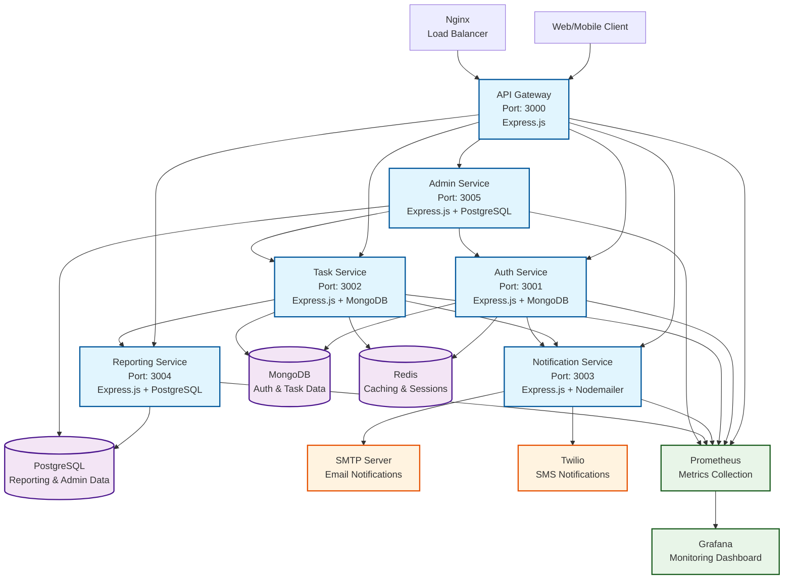

## Data Flow Diagram

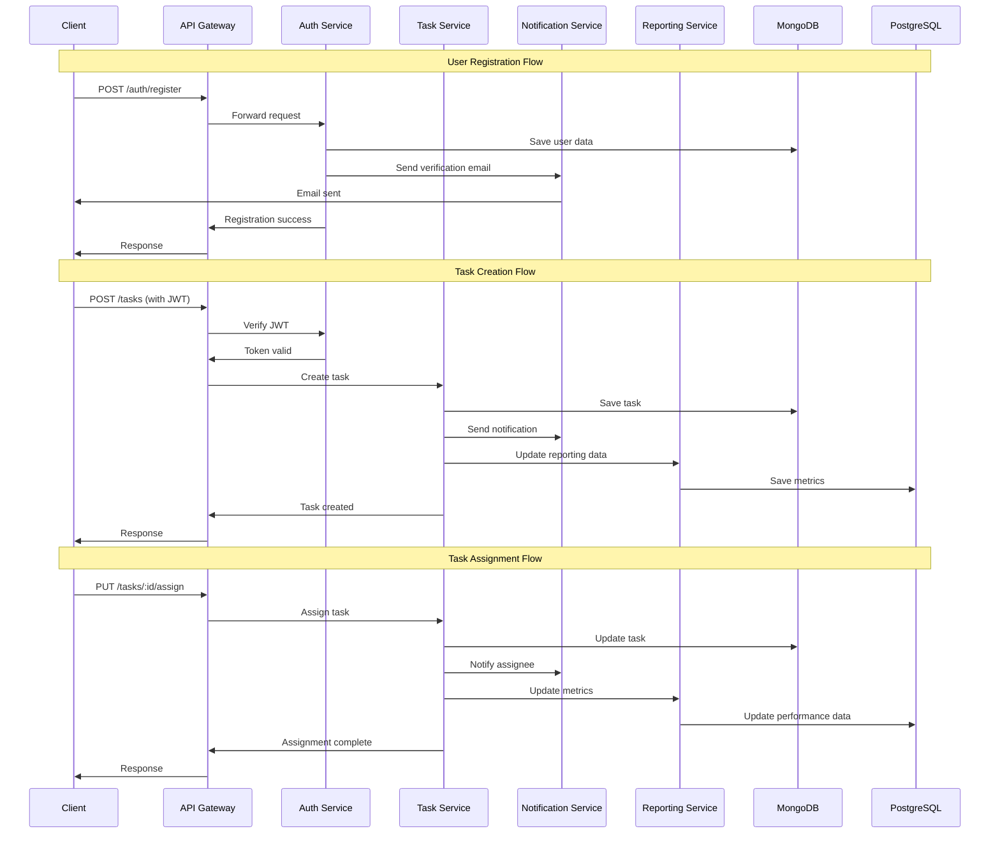

## Database Schema Overview

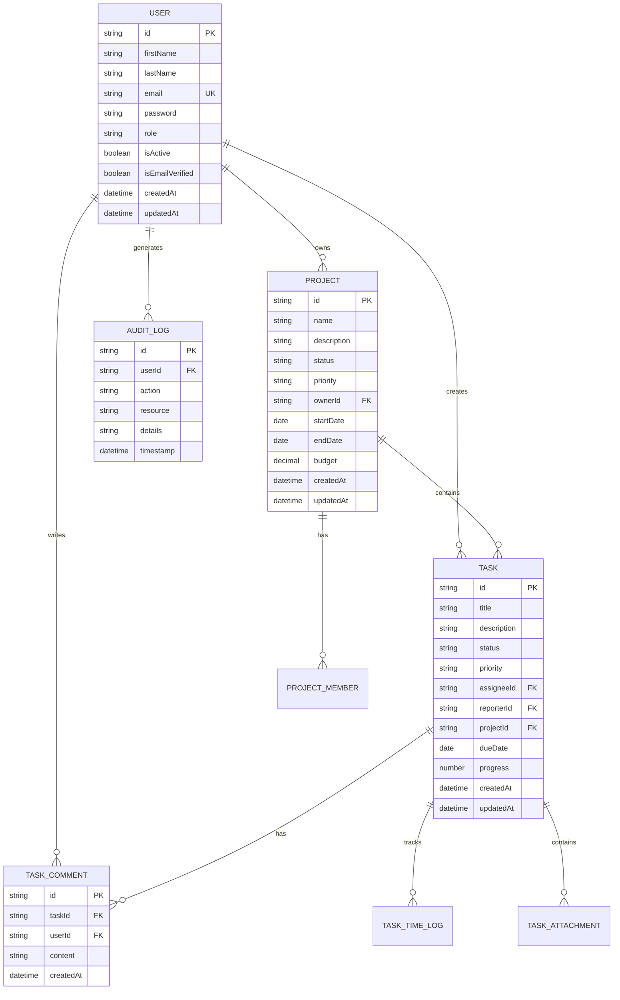

## Deployment Architecture

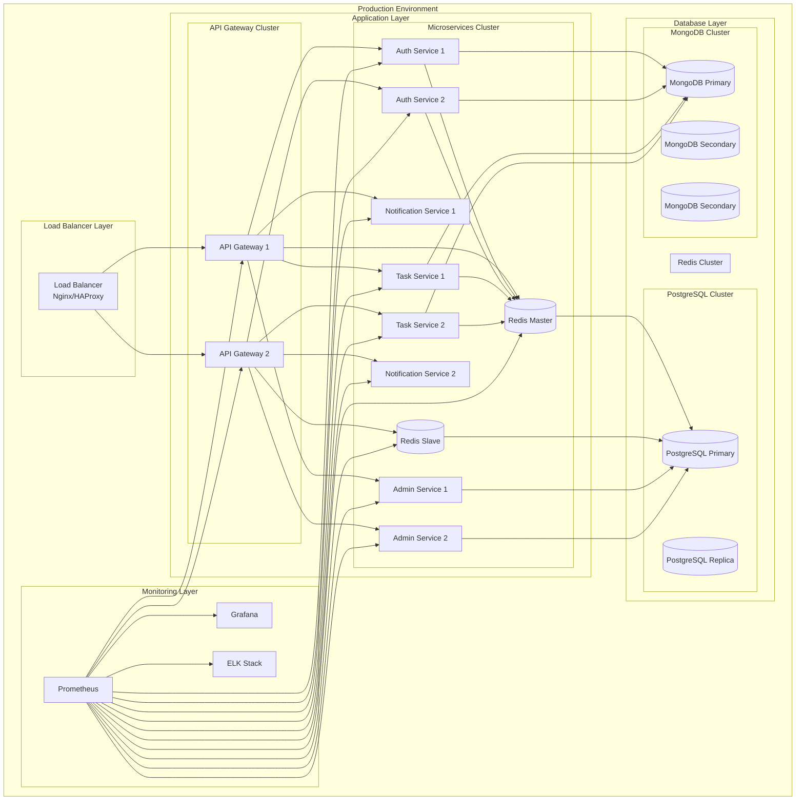

## Technology Stack

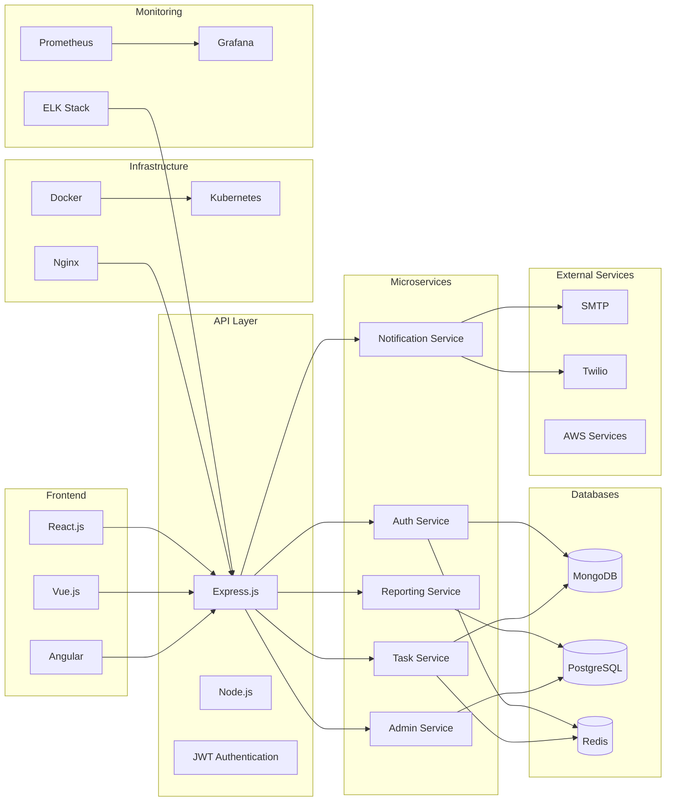

## Service Communication Patterns

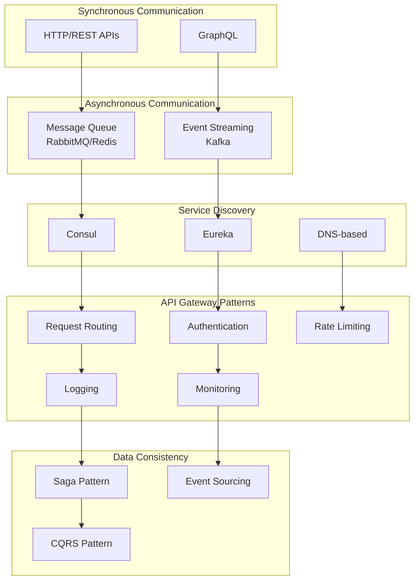

## Security Architecture

```mermaid
graph TB
    subgraph "Security Layers"
        WAF[Web Application Firewall]
        LB[Load Balancer with SSL]
        Gateway[API Gateway Security]
        Service[Service-level Security]
        DB[Database Security]
    end

    subgraph "Authentication & Authorization"
        JWT[JWT Tokens]
        OAuth[OAuth 2.0]
        RBAC[Role-based Access Control]
        MFA[Multi-factor Authentication]
    end

    subgraph "Data Protection"
        Encryption[Data Encryption]
        Hashing[Password Hashing]
        Masking[Data Masking]
        Backup[Secure Backups]
    end

    subgraph "Network Security"
        VPN[VPN Access]
        Firewall[Network Firewall]
        VPC[Virtual Private Cloud]
        Subnet[Private Subnets]
    end

    subgraph "Monitoring & Compliance"
        Audit[Audit Logging]
        SIEM[SIEM Integration]
        Compliance[Compliance Checks]
        Alerts[Security Alerts]
    end

    WAF --> LB
    LB --> Gateway
    Gateway --> Service
    Service --> DB

    JWT --> OAuth
    OAuth --> RBAC
    RBAC --> MFA

    Encryption --> Hashing
    Hashing --> Masking
    Masking --> Backup

    VPN --> Firewall
    Firewall --> VPC
    VPC --> Subnet

    Audit --> SIEM
    SIEM --> Compliance
    Compliance --> Alerts
```

## Performance Optimization

```mermaid
graph TB
    subgraph "Caching Strategy"
        CDN[CDN Caching]
        Redis[Redis Caching]
        DB[Database Caching]
        App[Application Caching]
    end

    subgraph "Load Balancing"
        RoundRobin[Round Robin]
        LeastConn[Least Connections]
        Weighted[Weighted Round Robin]
        Health[Health Check Based]
    end

    subgraph "Database Optimization"
        Indexing[Database Indexing]
        Sharding[Data Sharding]
        Replication[Read Replicas]
        Partitioning[Table Partitioning]
    end

    subgraph "Application Optimization"
        Pooling[Connection Pooling]
        Compression[Response Compression]
        Minification[Code Minification]
        Lazy[Lazy Loading]
    end

    subgraph "Infrastructure Scaling"
        Horizontal[Horizontal Scaling]
        Vertical[Vertical Scaling]
        Auto[Auto Scaling]
        Load[Load Testing]
    end

    CDN --> Redis
    Redis --> DB
    DB --> App

    RoundRobin --> LeastConn
    LeastConn --> Weighted
    Weighted --> Health

    Indexing --> Sharding
    Sharding --> Replication
    Replication --> Partitioning

    Pooling --> Compression
    Compression --> Minification
    Minification --> Lazy

    Horizontal --> Vertical
    Vertical --> Auto
    Auto --> Load
```

## Error Handling & Resilience

```mermaid
graph TB
    subgraph "Error Handling Patterns"
        TryCatch[Try-Catch Blocks]
        Validation[Input Validation]
        Logging[Error Logging]
        Monitoring[Error Monitoring]
    end

    subgraph "Resilience Patterns"
        Circuit[Circuit Breaker]
        Retry[Retry Mechanism]
        Timeout[Timeout Handling]
        Fallback[Fallback Strategies]
    end

    subgraph "Graceful Degradation"
        Service[Service Degradation]
        Feature[Feature Flags]
        Cache[Cache Fallback]
        Static[Static Responses]
    end

    subgraph "Recovery Mechanisms"
        Health[Health Checks]
        Restart[Auto Restart]
        Rollback[Rollback Strategy]
        Backup[Backup Recovery]
    end

    TryCatch --> Validation
    Validation --> Logging
    Logging --> Monitoring

    Circuit --> Retry
    Retry --> Timeout
    Timeout --> Fallback

    Service --> Feature
    Feature --> Cache
    Cache --> Static

    Health --> Restart
    Restart --> Rollback
    Rollback --> Backup
```

## Development Workflow

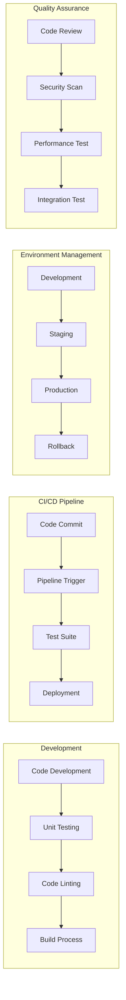

## API Documentation Structure

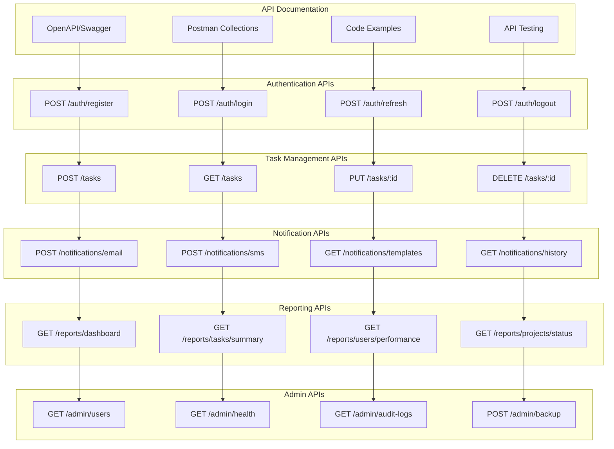

## Container Orchestration

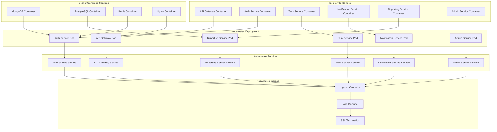

## Monitoring & Observability

```mermaid
graph TB
    subgraph "Metrics Collection"
        Prometheus[Prometheus Server]
        NodeExporter[Node Exporter]
        AppMetrics[Application Metrics]
        CustomMetrics[Custom Metrics]
    end

    subgraph "Logging"
        Fluentd[Fluentd]
        Logstash[Logstash]
        Elasticsearch[Elasticsearch]
        Kibana[Kibana]
    end

    subgraph "Tracing"
        Jaeger[Jaeger]
        Zipkin[Zipkin]
        OpenTelemetry[OpenTelemetry]
        DistributedTracing[Distributed Tracing]
    end

    subgraph "Alerting"
        AlertManager[Alert Manager]
        PagerDuty[PagerDuty]
        Slack[Slack Notifications]
        Email[Email Alerts]
    end

    subgraph "Dashboards"
        Grafana[Grafana Dashboards]
        CustomDashboards[Custom Dashboards]
        RealTime[Real-time Monitoring]
        Historical[Historical Analysis]
    end

    Prometheus --> NodeExporter
    NodeExporter --> AppMetrics
    AppMetrics --> CustomMetrics

    Fluentd --> Logstash
    Logstash --> Elasticsearch
    Elasticsearch --> Kibana

    Jaeger --> Zipkin
    Zipkin --> OpenTelemetry
    OpenTelemetry --> DistributedTracing

    AlertManager --> PagerDuty
    PagerDuty --> Slack
    Slack --> Email

    Grafana --> CustomDashboards
    CustomDashboards --> RealTime
    RealTime --> Historical
```

## Disaster Recovery

```mermaid
graph TB
    subgraph "Backup Strategy"
        DatabaseBackup[Database Backups]
        FileBackup[File Backups]
        ConfigBackup[Configuration Backups]
        CodeBackup[Code Repository Backups]
    end

    subgraph "Recovery Procedures"
        RTO[RTO - Recovery Time Objective]
        RPO[RPO - Recovery Point Objective]
        Failover[Failover Procedures]
        Restore[Restore Procedures]
    end

    subgraph "High Availability"
        MultiRegion[Multi-Region Deployment]
        LoadBalancing[Load Balancing]
        HealthChecks[Health Checks]
        AutoScaling[Auto Scaling]
    end

    subgraph "Business Continuity"
        DisasterPlan[Disaster Recovery Plan]
        Communication[Communication Plan]
        Testing[Regular Testing]
        Documentation[Documentation]
    end

    DatabaseBackup --> FileBackup
    FileBackup --> ConfigBackup
    ConfigBackup --> CodeBackup

    RTO --> RPO
    RPO --> Failover
    Failover --> Restore

    MultiRegion --> LoadBalancing
    LoadBalancing --> HealthChecks
    HealthChecks --> AutoScaling

    DisasterPlan --> Communication
    Communication --> Testing
    Testing --> Documentation
```

## Cost Optimization

```mermaid
graph TB
    subgraph "Resource Optimization"
        RightSizing[Right-sizing Instances]
        AutoScaling[Auto Scaling]
        SpotInstances[Spot Instances]
        ReservedInstances[Reserved Instances]
    end

    subgraph "Storage Optimization"
        DataCompression[Data Compression]
        LifecycleManagement[Lifecycle Management]
        Archival[Data Archival]
        Cleanup[Regular Cleanup]
    end

    subgraph "Network Optimization"
        CDN[CDN Usage]
        Compression[Response Compression]
        Caching[Intelligent Caching]
        Bandwidth[Bandwidth Optimization]
    end

    subgraph "Monitoring & Analysis"
        CostMonitoring[Cost Monitoring]
        UsageAnalysis[Usage Analysis]
        Optimization[Optimization Recommendations]
        BudgetAlerts[Budget Alerts]
    end

    RightSizing --> AutoScaling
    AutoScaling --> SpotInstances
    SpotInstances --> ReservedInstances

    DataCompression --> LifecycleManagement
    LifecycleManagement --> Archival
    Archival --> Cleanup

    CDN --> Compression
    Compression --> Caching
    Caching --> Bandwidth

    CostMonitoring --> UsageAnalysis
    UsageAnalysis --> Optimization
    Optimization --> BudgetAlerts
```

## Security Compliance

```mermaid
graph TB
    subgraph "Compliance Standards"
        GDPR[GDPR Compliance]
        SOC2[SOC 2 Type II]
        ISO27001[ISO 27001]
        PCI[PCI DSS]
    end

    subgraph "Data Protection"
        Encryption[Data Encryption]
        AccessControl[Access Control]
        DataMasking[Data Masking]
        AuditTrail[Audit Trail]
    end

    subgraph "Security Controls"
        Authentication[Strong Authentication]
        Authorization[Role-based Authorization]
        NetworkSecurity[Network Security]
        ApplicationSecurity[Application Security]
    end

    subgraph "Monitoring & Reporting"
        SecurityMonitoring[Security Monitoring]
        ComplianceReporting[Compliance Reporting]
        IncidentResponse[Incident Response]
        RegularAudits[Regular Audits]
    end

    GDPR --> SOC2
    SOC2 --> ISO27001
    ISO27001 --> PCI

    Encryption --> AccessControl
    AccessControl --> DataMasking
    DataMasking --> AuditTrail

    Authentication --> Authorization
    Authorization --> NetworkSecurity
    NetworkSecurity --> ApplicationSecurity

    SecurityMonitoring --> ComplianceReporting
    ComplianceReporting --> IncidentResponse
    IncidentResponse --> RegularAudits
```

## Performance Benchmarks

```mermaid
graph TB
    subgraph "Load Testing"
        JMeter[Apache JMeter]
        K6[K6 Load Testing]
        Artillery[Artillery.io]
        CustomScripts[Custom Test Scripts]
    end

    subgraph "Performance Metrics"
        ResponseTime[Response Time]
        Throughput[Throughput]
        ErrorRate[Error Rate]
        ResourceUsage[Resource Usage]
    end

    subgraph "Scalability Testing"
        HorizontalScaling[Horizontal Scaling]
        VerticalScaling[Vertical Scaling]
        DatabaseScaling[Database Scaling]
        CacheScaling[Cache Scaling]
    end

    subgraph "Optimization Results"
        BeforeOptimization[Before Optimization]
        AfterOptimization[After Optimization]
        Improvement[Performance Improvement]
        Recommendations[Optimization Recommendations]
    end

    JMeter --> K6
    K6 --> Artillery
    Artillery --> CustomScripts

    ResponseTime --> Throughput
    Throughput --> ErrorRate
    ErrorRate --> ResourceUsage

    HorizontalScaling --> VerticalScaling
    VerticalScaling --> DatabaseScaling
    DatabaseScaling --> CacheScaling

    BeforeOptimization --> AfterOptimization
    AfterOptimization --> Improvement
    Improvement --> Recommendations
```

## Future Roadmap

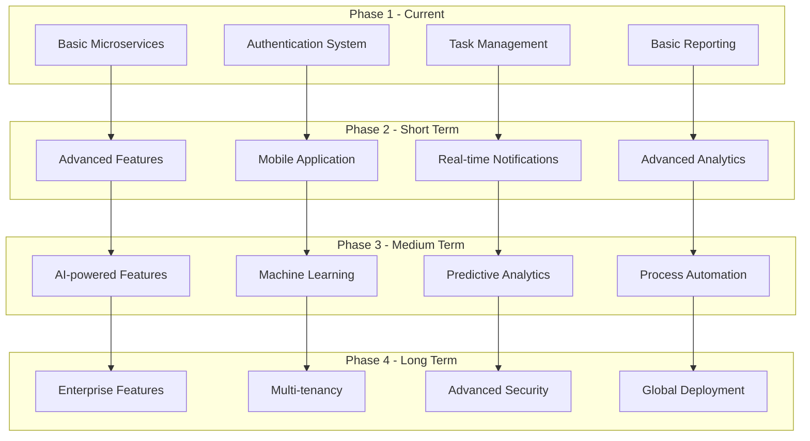

## Technology Evolution

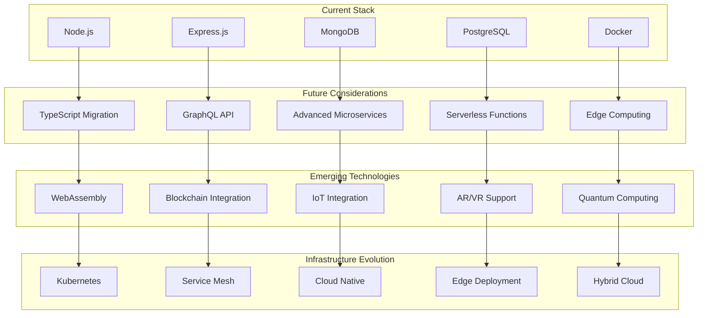

## API Versioning Strategy

```mermaid
graph TB
    subgraph "Versioning Approaches"
        URLVersioning[URL Versioning]
        HeaderVersioning[Header Versioning]
        QueryVersioning[Query Parameter Versioning]
        ContentNegotiation[Content Negotiation]
    end

    subgraph "Version Management"
        VersionControl[Version Control]
        Deprecation[Deprecation Policy]
        Migration[Migration Strategy]
        Documentation[Version Documentation]
    end

    subgraph "Backward Compatibility"
        BreakingChanges[Breaking Changes]
        NonBreakingChanges[Non-breaking Changes]
        DeprecationWarnings[Deprecation Warnings]
        MigrationGuides[Migration Guides]
    end

    subgraph "Testing Strategy"
        VersionTesting[Version Testing]
        CompatibilityTesting[Compatibility Testing]
        RegressionTesting[Regression Testing]
        IntegrationTesting[Integration Testing]
    end

    URLVersioning --> HeaderVersioning
    HeaderVersioning --> QueryVersioning
    QueryVersioning --> ContentNegotiation

    VersionControl --> Deprecation
    Deprecation --> Migration
    Migration --> Documentation

    BreakingChanges --> NonBreakingChanges
    NonBreakingChanges --> DeprecationWarnings
    DeprecationWarnings --> MigrationGuides

    VersionTesting --> CompatibilityTesting
    CompatibilityTesting --> RegressionTesting
    RegressionTesting --> IntegrationTesting
```

## Data Migration Strategy

```mermaid
graph TB
    subgraph "Migration Planning"
        Assessment[Data Assessment]
        Mapping[Data Mapping]
        Validation[Data Validation]
        Testing[Migration Testing]
    end

    subgraph "Migration Execution"
        Backup[Data Backup]
        Migration[Migration Execution]
        Verification[Data Verification]
        Rollback[Rollback Plan]
    end

    subgraph "Post-Migration"
        Monitoring[Post-Migration Monitoring]
        Optimization[Performance Optimization]
        Cleanup[Data Cleanup]
        Documentation[Documentation Update]
    end

    subgraph "Risk Management"
        RiskAssessment[Risk Assessment]
        Mitigation[Mitigation Strategies]
        Contingency[Contingency Plans]
        Communication[Communication Plan]
    end

    Assessment --> Mapping
    Mapping --> Validation
    Validation --> Testing

    Backup --> Migration
    Migration --> Verification
    Verification --> Rollback

    Monitoring --> Optimization
    Optimization --> Cleanup
    Cleanup --> Documentation

    RiskAssessment --> Mitigation
    Mitigation --> Contingency
    Contingency --> Communication
```

## Integration Patterns

```mermaid
graph TB
    subgraph "Integration Types"
        REST[REST API Integration]
        GraphQL[GraphQL Integration]
        MessageQueue[Message Queue Integration]
        EventStreaming[Event Streaming Integration]
    end

    subgraph "Data Integration"
        ETL[ETL Processes]
        RealTime[Real-time Data Sync]
        Batch[Batch Processing]
        Streaming[Stream Processing]
    end

    subgraph "Third-party Integrations"
        OAuth[OAuth Integration]
        Webhook[Webhook Integration]
        SDK[SDK Integration]
        API[Third-party APIs]
    end

    subgraph "Internal Integrations"
        ServiceMesh[Service Mesh]
        EventBus[Event Bus]
        SharedDatabase[Shared Database]
        FileSystem[File System Integration]
    end

    REST --> GraphQL
    GraphQL --> MessageQueue
    MessageQueue --> EventStreaming

    ETL --> RealTime
    RealTime --> Batch
    Batch --> Streaming

    OAuth --> Webhook
    Webhook --> SDK
    SDK --> API

    ServiceMesh --> EventBus
    EventBus --> SharedDatabase
    SharedDatabase --> FileSystem
```

## Quality Assurance

```mermaid
graph TB
    subgraph "Testing Strategy"
        UnitTesting[Unit Testing]
        IntegrationTesting[Integration Testing]
        EndToEndTesting[End-to-End Testing]
        PerformanceTesting[Performance Testing]
    end

    subgraph "Code Quality"
        CodeReview[Code Review]
        StaticAnalysis[Static Analysis]
        CodeCoverage[Code Coverage]
        Linting[Code Linting]
    end

    subgraph "Security Testing"
        VulnerabilityScanning[Vulnerability Scanning]
        PenetrationTesting[Penetration Testing]
        SecurityAudit[Security Audit]
        ComplianceTesting[Compliance Testing]
    end

    subgraph "Continuous Quality"
        CICD[CI/CD Pipeline]
        AutomatedTesting[Automated Testing]
        QualityGates[Quality Gates]
        Feedback[Feedback Loop]
    end

    UnitTesting --> IntegrationTesting
    IntegrationTesting --> EndToEndTesting
    EndToEndTesting --> PerformanceTesting

    CodeReview --> StaticAnalysis
    StaticAnalysis --> CodeCoverage
    CodeCoverage --> Linting

    VulnerabilityScanning --> PenetrationTesting
    PenetrationTesting --> SecurityAudit
    SecurityAudit --> ComplianceTesting

    CICD --> AutomatedTesting
    AutomatedTesting --> QualityGates
    QualityGates --> Feedback
```

## Documentation Strategy

```mermaid
graph TB
    subgraph "Technical Documentation"
        APIDocs[API Documentation]
        ArchitectureDocs[Architecture Documentation]
        DeploymentDocs[Deployment Documentation]
        Troubleshooting[Troubleshooting Guides]
    end

    subgraph "User Documentation"
        UserGuides[User Guides]
        AdminGuides[Admin Guides]
        DeveloperGuides[Developer Guides]
        FAQ[Frequently Asked Questions]
    end

    subgraph "Process Documentation"
        DevelopmentProcess[Development Process]
        DeploymentProcess[Deployment Process]
        MaintenanceProcess[Maintenance Process]
        IncidentResponse[Incident Response]
    end

    subgraph "Knowledge Management"
        Wiki[Internal Wiki]
        Documentation[Documentation Site]
        Training[Training Materials]
        BestPractices[Best Practices]
    end

    APIDocs --> ArchitectureDocs
    ArchitectureDocs --> DeploymentDocs
    DeploymentDocs --> Troubleshooting

    UserGuides --> AdminGuides
    AdminGuides --> DeveloperGuides
    DeveloperGuides --> FAQ

    DevelopmentProcess --> DeploymentProcess
    DeploymentProcess --> MaintenanceProcess
    MaintenanceProcess --> IncidentResponse

    Wiki --> Documentation
    Documentation --> Training
    Training --> BestPractices
```

## Support & Maintenance

```mermaid
graph TB
    subgraph "Support Levels"
        L1[Level 1 Support]
        L2[Level 2 Support]
        L3[Level 3 Support]
        Escalation[Escalation Process]
    end

    subgraph "Maintenance Activities"
        RegularUpdates[Regular Updates]
        SecurityPatches[Security Patches]
        BugFixes[Bug Fixes]
        FeatureUpdates[Feature Updates]
    end

    subgraph "Monitoring & Alerting"
        HealthChecks[Health Checks]
        PerformanceMonitoring[Performance Monitoring]
        ErrorTracking[Error Tracking]
        AlertManagement[Alert Management]
    end

    subgraph "Incident Management"
        IncidentDetection[Incident Detection]
        IncidentResponse[Incident Response]
        RootCauseAnalysis[Root Cause Analysis]
        PostIncidentReview[Post-Incident Review]
    end

    L1 --> L2
    L2 --> L3
    L3 --> Escalation

    RegularUpdates --> SecurityPatches
    SecurityPatches --> BugFixes
    BugFixes --> FeatureUpdates

    HealthChecks --> PerformanceMonitoring
    PerformanceMonitoring --> ErrorTracking
    ErrorTracking --> AlertManagement

    IncidentDetection --> IncidentResponse
    IncidentResponse --> RootCauseAnalysis
    RootCauseAnalysis --> PostIncidentReview
```

## Business Continuity

```mermaid
graph TB
    subgraph "Business Continuity Planning"
        RiskAssessment[Risk Assessment]
        BusinessImpact[Business Impact Analysis]
        ContinuityPlan[Continuity Plan]
        RecoveryProcedures[Recovery Procedures]
    end

    subgraph "Disaster Recovery"
        BackupStrategy[Backup Strategy]
        RecoveryTime[Recovery Time Objectives]
        RecoveryPoint[Recovery Point Objectives]
        Failover[Failover Procedures]
    end

    subgraph "High Availability"
        Redundancy[System Redundancy]
        LoadBalancing[Load Balancing]
        HealthMonitoring[Health Monitoring]
        AutoRecovery[Auto Recovery]
    end

    subgraph "Communication"
        StakeholderCommunication[Stakeholder Communication]
        StatusUpdates[Status Updates]
        Escalation[Escalation Procedures]
        Documentation[Documentation]
    end

    RiskAssessment --> BusinessImpact
    BusinessImpact --> ContinuityPlan
    ContinuityPlan --> RecoveryProcedures

    BackupStrategy --> RecoveryTime
    RecoveryTime --> RecoveryPoint
    RecoveryPoint --> Failover

    Redundancy --> LoadBalancing
    LoadBalancing --> HealthMonitoring
    HealthMonitoring --> AutoRecovery

    StakeholderCommunication --> StatusUpdates
    StatusUpdates --> Escalation
    Escalation --> Documentation
```

## Cost Management

```mermaid
graph TB
    subgraph "Cost Optimization"
        ResourceOptimization[Resource Optimization]
        RightSizing[Right-sizing]
        AutoScaling[Auto Scaling]
        CostMonitoring[Cost Monitoring]
    end

    subgraph "Budget Management"
        BudgetPlanning[Budget Planning]
        CostAllocation[Cost Allocation]
        BudgetTracking[Budget Tracking]
        CostReporting[Cost Reporting]
    end

    subgraph "Resource Management"
        InstanceManagement[Instance Management]
        StorageManagement[Storage Management]
        NetworkManagement[Network Management]
        ServiceManagement[Service Management]
    end

    subgraph "Financial Planning"
        Forecasting[Cost Forecasting]
        TrendAnalysis[Trend Analysis]
        Optimization[Optimization Recommendations]
        Investment[Investment Planning]
    end

    ResourceOptimization --> RightSizing
    RightSizing --> AutoScaling
    AutoScaling --> CostMonitoring

    BudgetPlanning --> CostAllocation
    CostAllocation --> BudgetTracking
    BudgetTracking --> CostReporting

    InstanceManagement --> StorageManagement
    StorageManagement --> NetworkManagement
    NetworkManagement --> ServiceManagement

    Forecasting --> TrendAnalysis
    TrendAnalysis --> Optimization
    Optimization --> Investment
```

## Innovation & Research

```mermaid
graph TB
    subgraph "Research Areas"
        EmergingTech[Emerging Technologies]
        IndustryTrends[Industry Trends]
        BestPractices[Best Practices]
        Innovation[Innovation Opportunities]
    end

    subgraph "Technology Evaluation"
        ProofOfConcept[Proof of Concept]
        PilotProjects[Pilot Projects]
        TechnologyAssessment[Technology Assessment]
        RiskAnalysis[Risk Analysis]
    end

    subgraph "Innovation Implementation"
        InnovationPipeline[Innovation Pipeline]
        ResourceAllocation[Resource Allocation]
        Timeline[Implementation Timeline]
        SuccessMetrics[Success Metrics]
    end

    subgraph "Knowledge Sharing"
        InternalSharing[Internal Knowledge Sharing]
        ExternalSharing[External Knowledge Sharing]
        Community[Community Engagement]
        Documentation[Innovation Documentation]
    end

    EmergingTech --> IndustryTrends
    IndustryTrends --> BestPractices
    BestPractices --> Innovation

    ProofOfConcept --> PilotProjects
    PilotProjects --> TechnologyAssessment
    TechnologyAssessment --> RiskAnalysis

    InnovationPipeline --> ResourceAllocation
    ResourceAllocation --> Timeline
    Timeline --> SuccessMetrics

    InternalSharing --> ExternalSharing
    ExternalSharing --> Community
    Community --> Documentation
```

## Success Metrics

```mermaid
graph TB
    subgraph "Technical Metrics"
        Performance[Performance Metrics]
        Reliability[Reliability Metrics]
        Scalability[Scalability Metrics]
        Security[Security Metrics]
    end

    subgraph "Business Metrics"
        UserSatisfaction[User Satisfaction]
        BusinessValue[Business Value]
        ROI[Return on Investment]
        MarketShare[Market Share]
    end

    subgraph "Operational Metrics"
        Uptime[System Uptime]
        ResponseTime[Response Time]
        ErrorRate[Error Rate]
        Throughput[Throughput]
    end

    subgraph "Quality Metrics"
        CodeQuality[Code Quality]
        TestCoverage[Test Coverage]
        BugRate[Bug Rate]
        TechnicalDebt[Technical Debt]
    end

    Performance --> Reliability
    Reliability --> Scalability
    Scalability --> Security

    UserSatisfaction --> BusinessValue
    BusinessValue --> ROI
    ROI --> MarketShare

    Uptime --> ResponseTime
    ResponseTime --> ErrorRate
    ErrorRate --> Throughput

    CodeQuality --> TestCoverage
    TestCoverage --> BugRate
    BugRate --> TechnicalDebt
```

## Continuous Improvement

```mermaid
graph TB
    subgraph "Improvement Process"
        Assessment[Current State Assessment]
        GapAnalysis[Gap Analysis]
        ImprovementPlan[Improvement Plan]
        Implementation[Implementation]
    end

    subgraph "Feedback Loops"
        UserFeedback[User Feedback]
        SystemFeedback[System Feedback]
        PerformanceFeedback[Performance Feedback]
        BusinessFeedback[Business Feedback]
    end

    subgraph "Optimization"
        PerformanceOptimization[Performance Optimization]
        CostOptimization[Cost Optimization]
        ProcessOptimization[Process Optimization]
        ResourceOptimization[Resource Optimization]
    end

    subgraph "Innovation"
        TechnologyInnovation[Technology Innovation]
        ProcessInnovation[Process Innovation]
        BusinessInnovation[Business Innovation]
        CultureInnovation[Culture Innovation]
    end

    Assessment --> GapAnalysis
    GapAnalysis --> ImprovementPlan
    ImprovementPlan --> Implementation

    UserFeedback --> SystemFeedback
    SystemFeedback --> PerformanceFeedback
    PerformanceFeedback --> BusinessFeedback

    PerformanceOptimization --> CostOptimization
    CostOptimization --> ProcessOptimization
    ProcessOptimization --> ResourceOptimization

    TechnologyInnovation --> ProcessInnovation
    ProcessInnovation --> BusinessInnovation
    BusinessInnovation --> CultureInnovation
```

## Conclusion

This comprehensive system design diagram provides a complete overview of the Task Management System using microservices architecture. The diagrams cover:

1. **System Architecture** - Overall system structure and component relationships
2. **Data Flow** - How data moves through the system
3. **Database Schema** - Entity relationships and data structure
4. **Deployment Architecture** - Production deployment strategy
5. **Technology Stack** - All technologies used in the system
6. **Service Communication** - How services interact with each other
7. **Security Architecture** - Security layers and measures
8. **Performance Optimization** - Strategies for optimal performance
9. **Error Handling** - Resilience and error management
10. **Development Workflow** - Development and deployment processes
11. **API Documentation** - API structure and endpoints
12. **Container Orchestration** - Docker and Kubernetes setup
13. **Monitoring & Observability** - Monitoring and logging strategy
14. **Disaster Recovery** - Backup and recovery procedures
15. **Cost Optimization** - Cost management strategies
16. **Security Compliance** - Compliance and security standards
17. **Performance Benchmarks** - Testing and optimization
18. **Future Roadmap** - Planned enhancements and features
19. **Technology Evolution** - Future technology considerations
20. **API Versioning** - Version management strategy
21. **Data Migration** - Migration planning and execution
22. **Integration Patterns** - Integration strategies
23. **Quality Assurance** - Testing and quality processes
24. **Documentation Strategy** - Documentation approach
25. **Support & Maintenance** - Support and maintenance processes
26. **Business Continuity** - Business continuity planning
27. **Cost Management** - Financial management
28. **Innovation & Research** - Innovation and research areas
29. **Success Metrics** - Key performance indicators
30. **Continuous Improvement** - Ongoing improvement processes

These diagrams can be used with any Mermaid-compatible tool such as:

- Mermaid Live Editor (https://mermaid.live/)
- GitHub (supports Mermaid in markdown)
- GitLab (supports Mermaid in markdown)
- Notion (supports Mermaid)
- Draw.io (supports Mermaid import)
- VS Code (with Mermaid extensions)
- Confluence (with Mermaid plugins)

The diagrams provide a comprehensive visual representation of the entire system architecture and can be used for:

- System documentation
- Technical presentations
- Architecture reviews
- Onboarding new team members
- Planning future enhancements
- Troubleshooting and debugging
- Compliance and audit purposes
